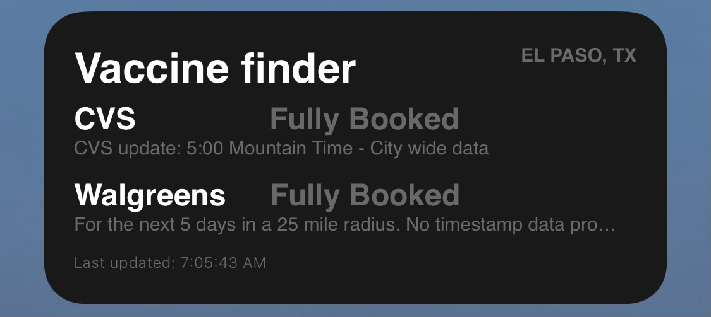
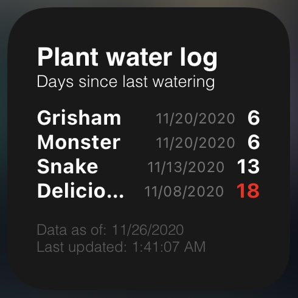

# Scriptable
Collection of widgets for Scriptable

## Widgets

* [Vaccine Finder widget](#VaccineFinder)
* [Plant Watering Log widget](#plant-watering-log-widget)
* [IP Address widget](#ip-address-widget)
* [Plant Monitor widget](#plant-monitor-widget)

--- 
### Vaccine Finder Widget
A widget that displays available COVID vaccine appointments at your local CVS / Walgreens.

The widget runs a simple setup process when loaded initially to capture location and pasteboard preferences (copy), displays current availability for both chains

 

--- 
### Plant Watering Log Widget
[Plant Watering Log Widget](plant-watering-log-widget/README.md), a widget to track days since you last watered plants. This widget works in conjunction with an IOS Shortcut, a Google sheet and Google scripts.
The widget displays the plant name, date and number of days that have passed since the last watering record.

   

---
### IP Address Widget
[IP Address Widget](ip-address-widget/currentip.js) ,a widget that shows your current external IP Address, IP location city, ISP name.
IP in screenshot is only representative.

 

--- 
### Plant Monitor Widget
[Plant Monitor Widget](plant-monitor-widget/plant-monitor-widget.js) ,a widget that pulls information from a local IOT device via JSON and displays it in a widget. 

  

